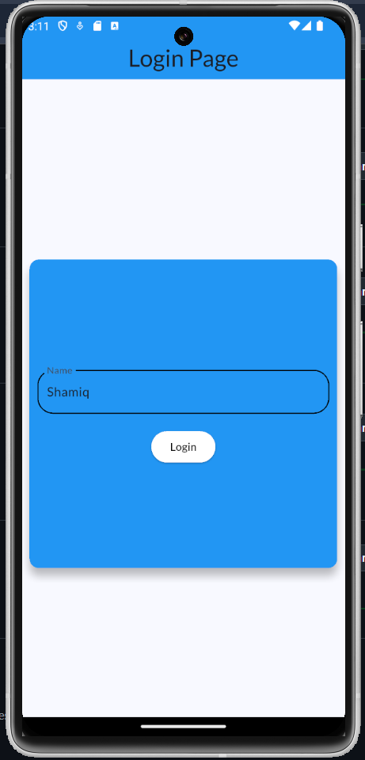
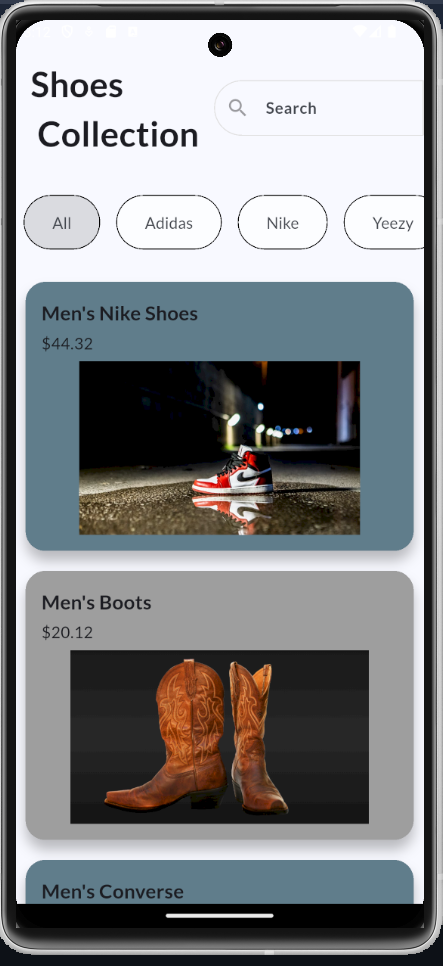
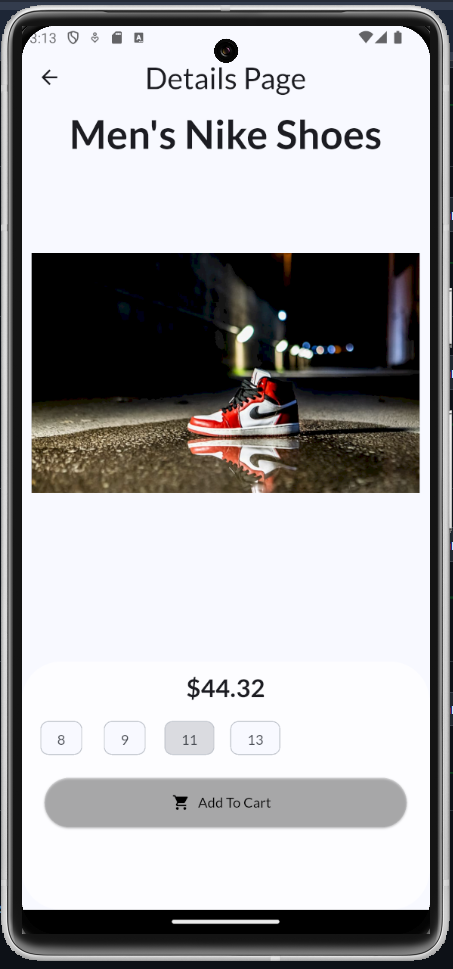
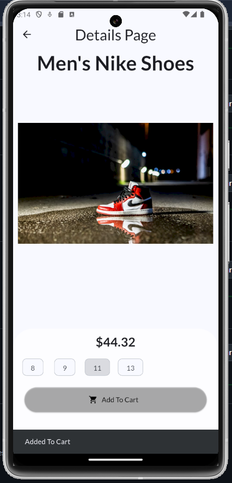

# 👟 Shoe Shopping App

A modern Flutter-based shoe shopping application that allows users to browse products, view detailed shoe information, and add items to their cart through a clean and intuitive user interface. The app focuses on delivering a smooth online shopping experience while demonstrating key Flutter development concepts.

---

## ✨ Features

* User Login Authentication
* Beautiful and Responsive Flutter UI
* Browse Shoe Collections
* Product Listing with Images
* Detailed Product Information
* Shoe Size Selection
* Add to Cart Functionality
* Smooth Navigation Between Screens
* Modern Shopping Experience
* Mobile-Friendly Design

---

## 📱 App Screens

### 🔐 Login Screen

The Login Screen provides a simple and secure entry point into the application. Users can authenticate themselves before accessing the shopping experience.

  

---

### 🏠 Home Screen

The Home Screen displays the complete shoe catalog, allowing users to browse available products. The clean layout makes it easy to explore different shoe options and select products for further details.

  

---

### 👟 Product Details Screen

When a user selects a shoe from the Home Screen, they are taken to the Product Details page. This screen displays a larger product image, price information, available sizes, product details, and an option to add the item directly to the cart.

  
  

---

## 🛠️ Tech Stack

* Flutter
* Dart
* Material Design

---

## 🎯 Key Concepts Demonstrated

* Flutter UI Development
* Responsive Design
* Navigation & Routing
* Product Catalog Management
* Shopping Cart Logic
* State Management
* Custom Widgets
* User Authentication
* Mobile App Architecture

---

## 🚀 Future Improvements

* Search Functionality
* Product Categories
* Wishlist Support
* User Profiles
* Online Payments
* Order History
* Product Reviews & Ratings
* Dark Mode Support
